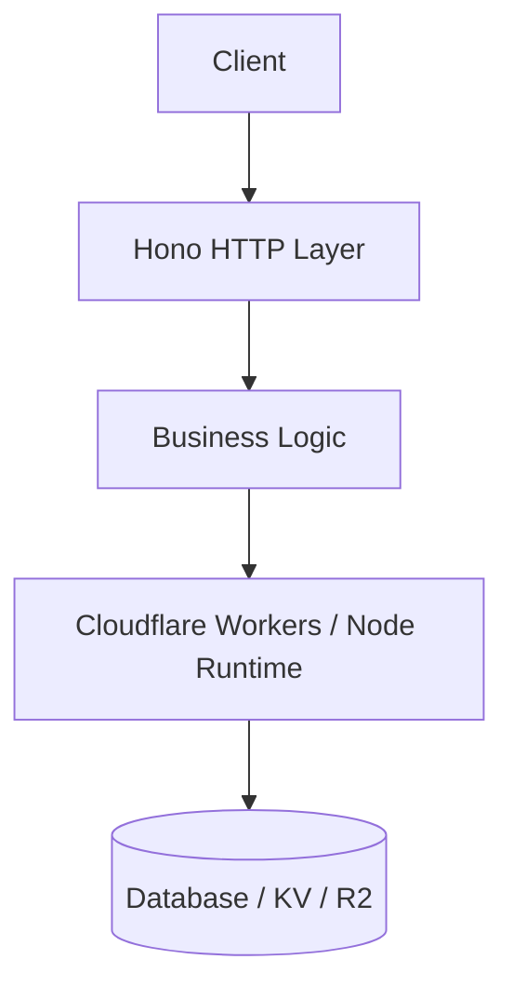

# ops-template


> Canonical project scaffold for all LoveLogicAI services — batteries included with CI, Docker, Biome, Hono, and Cloudflare Workers.

---

## Architecture Overview

<!-- Replace the placeholder below with your project's Mermaid diagram -->



---

## Quickstart

### 1. Clone & install

```bash
git clone https://github.com/LoveLogicAI/ops-template.git
cd ops-template
bun install
```

### 2. Configure environment

```bash
cp .env.example .env
# Edit .env with your values
```

### 3. Run dev server

```bash
bun run dev
```

### 4. Run tests

```bash
bun run test
```

### 5. Deploy

```bash
bun run deploy
```

---

## Environment Variables

| Variable                  | Default        | Description                          |
|---------------------------|----------------|--------------------------------------|
| `NODE_ENV`                | `development`  | Runtime environment                  |
| `PORT`                    | `3000`         | HTTP server port                     |
| `DATABASE_URL`            | —              | PostgreSQL / SQLite connection string|
| `CLOUDFLARE_ACCOUNT_ID`   | —              | Cloudflare account ID for Workers    |
| `CLOUDFLARE_API_TOKEN`    | —              | Cloudflare API token for deployment  |
| `LOG_LEVEL`               | `info`         | Pino log level (debug/info/warn/error)|

See `.env.example` for the full list with descriptions.

---

## Contributing

1. Fork the repo and create a feature branch: `git checkout -b feat/my-feature`
2. Make your changes, ensuring all tests pass: `bun run test`
3. Run the linter and formatter: `bun run lint`
4. Open a pull request against `main` with a clear description

All PRs must pass CI before merging. Please follow the existing code style enforced by Biome.

---

## License

MIT © 2026 LoveLogicAI LLC — see [LICENSE](./LICENSE) for details.

---

<p align="center">Part of the <strong>LoveLogicAI Agent Company OS</strong></p>
